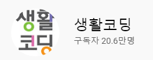
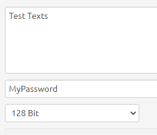
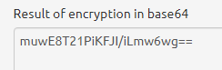
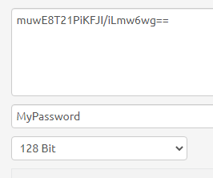
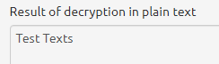
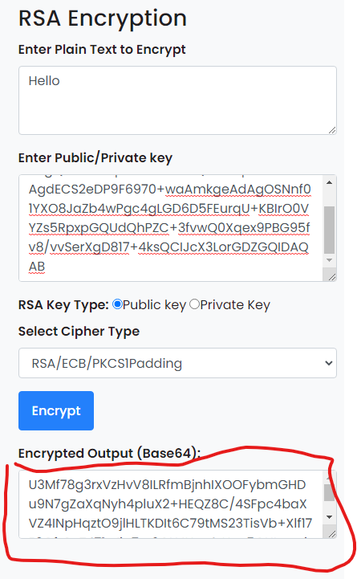
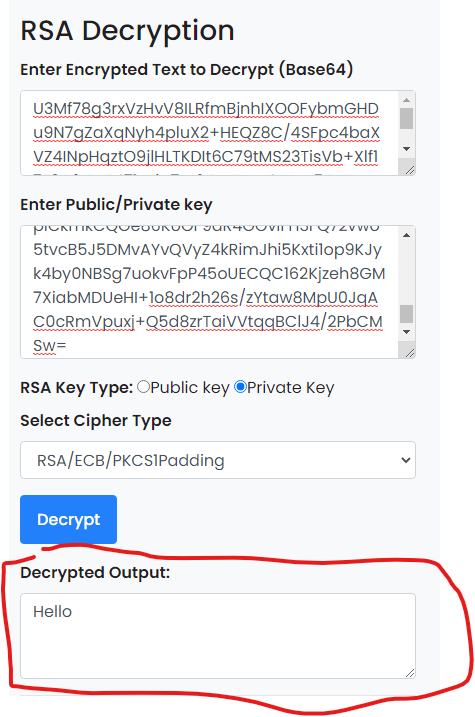

# Made By 생활코딩

아래 수업은 생활코딩의 영상을 참고하여 작성되었음

# 암호화

암호화 작업을 통해서 암호화 복호화 하는 작업을 알아보자

페이스북이나 인스타그램 , 유튜브 를 클론코딩하며 암호화를 시켜 데이터베이스에
넣는 경우가 많았는데 이 때에 사용되었던 md5 혹은 sha 도 모두 암호화 작업에서 사용되는 
것 들이다.

## 단방향 암호화

hash 알고리즘 이라고도 하는데 , 

위 사진과 같이 단순히 데이터를 넣어서 암호화만을 시킬 뿐 다시 복호화를 시키진 않는다.

데이터의 <b>무결성</b>을 유지하기 위하여 필요한 암호화이다.

## 양방향 암호화

대칭키 방식이라고도 하는데 

해당 <a href="https://aesencryption.net/">사이트</a> 에 들어가서 예를 보면,

해당 텍스트를 128 Bit 로 MyPassword 라는 키와 같이 암호화 시키면

가 나오며 이 결과를 바탕으로

이 텍스트를 위와 같은 조건에서 복호화 시키면

가 된다.

데이터를 보안하고 다시 필요할 때 찾아쓰는 경우에 사용된다.

## 비대칭 키 방식

공개 키 , 비밀 키 로 이루어져 있으며 공개키를 이용하여 암호화 한 정보를

비밀 키 를 이용하여 복호화 한다.

해당 <a href="https://www.devglan.com/online-tools/rsa-encryption-decryption">사이트</a>에 가보자

Generate Key 를 하여 공개 키 , 비밀 키를 발급받는다.

공개 키를 사용하여 내가 원하고자 하는 문장을 암호화 하면 특수한 문자열이 반환되는데 이를 복사한다.

비밀 키를 이용하여 특수한 문자열을 복호화 시키면 내가 적었던 문자열이 반환된다.

